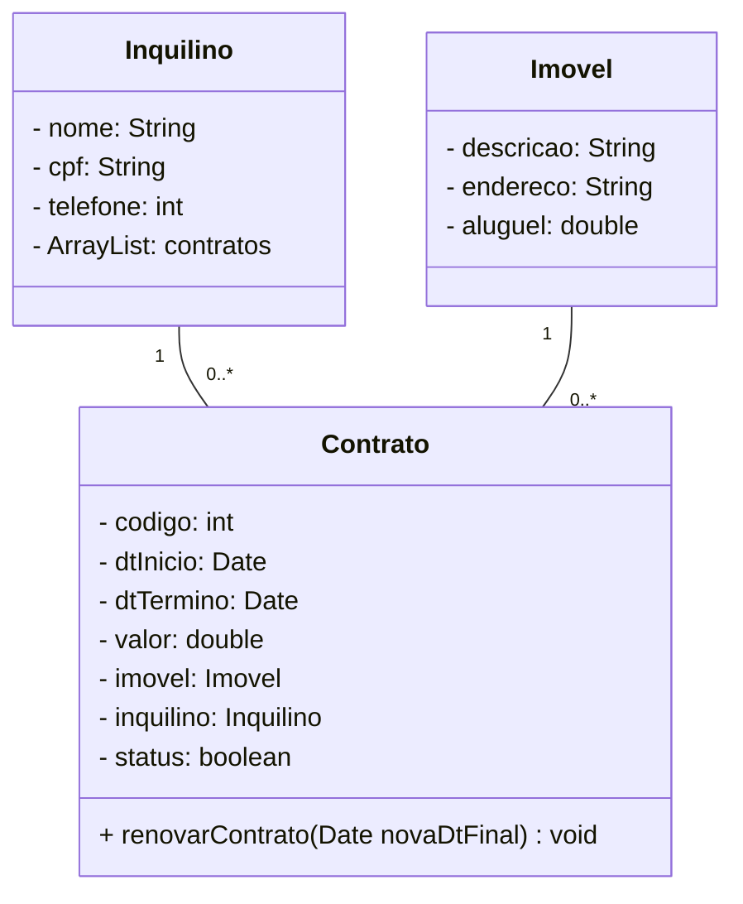

```mermaid

classDiagram
    direction TB

class Imovel {
    - descricao: String
    - endereco: String
    - aluguel: double
}

class Inquilino{
    - nome: String
    - cpf: String
    - telefone: int
    - ArrayList<Contrato>: contratos
}

class Contrato{
    - codigo: int
    - dtInicio: Date
    - dtTermino: Date
    - valor: double
    - imovel: Imovel
    - inquilino: Inquilino
    - status: boolean
    + renovarContrato(Date novaDtFinal) void
}

Inquilino "1" -- "0..*" Contrato
Imovel "1" -- "0..*" Contrato


```